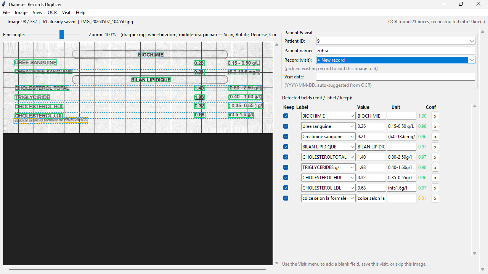
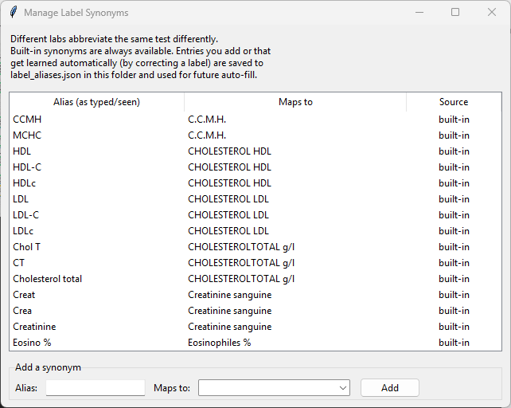
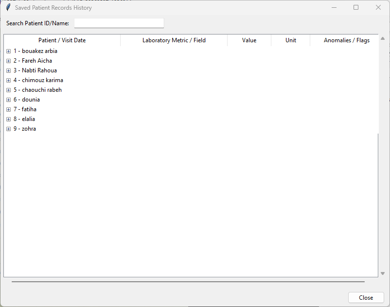

# Medical Records Digitizer


[](../LICENSE)

A desktop application designed to scan, digitize, and review laboratory follow-up forms into structured, per-patient records. Built using Python with a Tkinter graphical interface, it leverages Advanced Image Processing (OpenCV) and PaddleOCR to streamline data entry for healthcare metrics.

---

## Features

* **Advanced Document Preprocessing**: 
  * Perspective-correction ("flat scan" effect) using automatic contour boundary detection.
  * Adaptive uneven lighting and shadow removal.
  * Contrast optimization via CLAHE (Contrast Limited Adaptive Histogram Equalization).
  * Automated orientation check (rotates landscape photos back to portrait format).
* **Robust Text Extraction & Alignment**:
  * Powered by PaddleOCR for high-precision text detection.
  * Intelligently groups fragmented word blocks horizontally to handle dot leaders (e.g., `HEMATIES ..... 4.90`) and extracts accurate values, labels, and units.
* **Smart Vocabulary & Synonym Learning**:
  * Map regional lab terminology or custom acronyms to standard diagnostic categories.
  * Automatically learns new lab shorthand variants directly from review corrections.
* **Interactive Data Grid**: 
  * Real-time range checking and outlier identification for specialized metrics (HbA1c, Glycemia, BMI, Blood Pressure, etc.).
  * Direct manual field creation alongside existing data loading and comparison capabilities.
* **Flexible Exports**: Writes organized structured profiles downstream into standalone, per-patient JSON profiles as well as an inclusive master `records.csv` compilation.

---

## Getting Started

### Screenshot







### Installation

1. Clone the repository and navigate into it:
   ```bash
   git clone https://github.com/abdoulahmr/Medical-Report-Scanner
   cd Medical-Report-Scanner

2. Create virtual environment and activate it:
   ```bash
   python -m venv venv
   source venv/bin/activate (macOS / Linux)
   .\venv\Scripts\activate (windows)

3. install required libraries and run:
   ```bash
   pip install -r requirements.txt
   python main.py

### Usage Instructions
1. Loading Images
- Go to **File > Select Folder... (Ctrl + O)** and select the workspace directory containing your raw patient report images. 
- Unprocessed images will load sequentially into the main view.

2. Document Preprocessing
- Select **Image > Scan (Ctrl + K)** to execute automatic perspective flattening, orientation correction, and ambient shadow removal.
- Use the **Fine Angle** slider to micro-adjust skew if needed.
- **Manual Adjustments:** Click and drag over the canvas to draw a bounding box for manual cropping, or use the Image menu options to toggle custom filters (Denoise, CLAHE Contrast enhancement).

3. Extracting Metrics (OCR)
- Click **OCR > Run OCR (Ctrl + R)** to run the parsing pipeline. (Note: The application will download required model weights automatically during the very first run).
- Green, orange, and red polygons will overlay the raw text to reflect model confidence distributions. Blue dashed lines highlight reconstructed horizontal rows.

4. Review & Data Entry
- **Patient Linkage:** Assign a Patient ID on the right side panel. If the ID is new, you can add a new patient name. If it belongs to an existing client, the application will query and load historical logs.

- **Group Visits:** To append the current document to an existing patient checkup date, select it from the Record (visit) drop-down menu. Leave it on + New record to generate a brand new consultation instance.

- **Data Verification:** Inspect the populated fields grid. Values lying outside predefined safe baseline boundaries will dynamically generate a colored warning notification flag next to the text field.

- **Custom Fields:** Hit **Visit > Add Blank Field** to introduce custom manual rows for anomalous data markers missed by auto-extraction.

5. Dictionary Expansion & Commit
- To establish custom shorthand translations (e.g., teaching the local engine that GAJ maps natively to standard Glycémie à jeun), simply select your desired diagnostic fallback within the interactive cell combo-box. The application logs modifications to local profiles on the fly.

- Navigate to **File > Manage Synonyms** to audit, clean, or verify the loaded abbreviation dictionary.

- Press **Visit > Save Visit & Next Image (Ctrl + S)** to compile the changes. All compiled fields are exported into your local workspace directory under ***records.csv*** and ***individual patients/{id}.json*** tracking logs automatically before advancing.